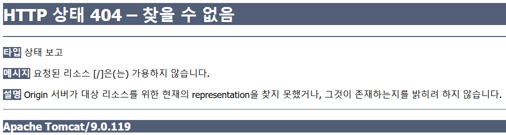

# Bulletin Board

A full-stack `Java web application` to practice `CRUD` functionality.

## List of Contents

- [1. Workspace Encoding](#1-workspace-encoding)
- [2. JDK Configuration](#2-jdk-configuration)
- [3. Apache Tomcat Runtime](#3-apache-tomcat-runtime)
- [4. Perspective Customization](#4-perspective-customization)
- [5. Project Properties](#5-project-properties)
- [6. Server Settings](#6-server-settings)
- [Lombok](#lombok)
- [Cryptography](#cryptography)
- [Troubleshooting](#troubleshooting)
- [Open with IntelliJ](#open-with-intellij)

---

## 1. Workspace Encoding

### Workspace

```sh
Window > Preferences > General > Workspace
```

- Text file encoding : `UTF-8`

### Text Editor Spelling

```sh
Window > Preferences > General > Editors > Text Editors > Spelling
```

- Encoding : `UTF-8`

### Web Files Encoding

```sh
Window > Preferences > Web > CSS Files
Window > Preferences > Web > HTML Files
Window > Preferences > Web > JSP Files
```

- Encoding : `UTF-8`

---

## 2. JDK Configuration

### Installed JREs

```sh
Window > Preferences > Java > Installed JREs
```

- select `jdk17.x.x`

### Java Compiler

```sh
Window > Preferences > Java > Compiler
```

- **Compiler compliance level**: `17`

---

## 3. Apache Tomcat Runtime

### Add Tomcat Runtime

```sh
Window > Preferences > Server > Runtime Environment
```

1. Click `add`
2. Select `apache`
3. Select `Tomcat v9.0 Server`

---

## 4. Perspective Customization

```sh
Window > Perspective > Customize Perspective
```

`Shortcuts` tab

- select `java` from category
    - uncheck `Java Project from Existing Ant Build file`
- select `web` from category
    - uncheck `Static Web Project`

---

## 5. Project properties

### Build Path

```sh
Project > Properties > Java Build Path
```

#### Libraries

1. select `Modulepath /  JRE System Library[]` then `Edit...`
2. under `Execution environment` select `jdk 17.x.x` or try `Workspace default JRE(jdk17.x.x)`

#### Server setting

1. Select `classpath` then `Add Library...`
2. `Server Runtime`
3. Check `Apache Tomcat v9.0`

---

### Project Facets

```sh
Project > Properties > Project Facets
```

- `Dynamic Web Module` to `4.0`
- `Java` to `17`

### Targeted Runtimes

```sh
Project > Properties > Targeted Runtimes
```

- `Apache Tomcat v9.0`

### Web Project Settings

```sh
Project > Properties > Web Project Settings
```

- `Context root`: `/`

---

## 6. Server Settings

```sh
Bottom Left > Servers > New Server
```

### Add Apache Tomcat

1. Select `Tomcat v9.0 Server`
2. Browse `Tomcat installation directory`
3. Select the tomcat installation directory

### Configure Apache Server

- Double click `Tomcat v9.0 Server at localhost`
    - Under the **Port Name** set port number of **HTTP/1.1** to `80`
    - Under the **Sever Options** check `Serve modules without publishing`

- Right click `Tomcat v9.0 Server at localhost`
    - From `add and removes` double-click the project you want to add or remove

---

## Lombok

1. Download [lombok](https://projectlombok.org/download) JAR file
2. Move it to `C:\Users\{user-name}\eclipse\jee-20xx-xx\eclipse\`
3. Double-click the fie and install or open the dir with terminal and execute
   the following

```sh
java -jar lombok.jar
```

Restart the PC to take effect.

---

## Cryptography

- `Plaintext`: The original data entered by the user
- `Encryption`: The process of converting plaintext into encoded or unreadable data
- `Decryption`: The process of converting encrypted data back into readable plaintext

### Symmetric Key Encryption

Encryption and decryption are performed using the `same key`

### Asymmetric Key Encryption

Uses a `public key` and a `private key`

- Public key: used for encryption
- Private key: used for decryption

### One-Way Hashing

Converts plaintext into a `fixed-length hashed value`

- Decryption is `not possible`
- Common algorithms:
    - `SHA-256`
    - `SHA-512`
    - `bcrypt` (adaptive password hashing algorithm)

---

## Troubleshooting



- Project Properties > **Web Project Settings**
    - **Context root**: `/`

- Servers view > double-click the server
    - Change to **Modules** view from lower left
        - Select the web module and **Edit...**
            - **Path**: `/`

---

## Open with [IntelliJ](https://www.jetbrains.com/idea/download/?section=windows)

> NOTE
> Select the actual project folder when opening, not parent folder of projects like in `Eclipse IDE`.

1. From right-sidebar click `Configure` at **Frameworks detected**.
2. Select `OK`.

### Settings

For **Lombok** support select `Enable annotation processing` from the notifications or

1. Open Settings (**Ctrl + Alt + S**) > Build, Execution, Deployment > Compiler > `Annotation Processors`
2. Check `Enable annotation processing`.

### Project Structure

Menubar > File > `Project structure...`(**Ctrl + Alt + Shift + S**)

- Project
    - **SDK**: `corretto-17`
    - **Language level**: `SDK default`

- Modules
    - **Dependencies** tab
        - **Module SDK**: From **Project SDK** to `corretto-17` explicitly

If IDE is not picking up the dependencies...

1. Click the **blue plus icon**
2. `1. JARs or Directories...`
3. Browse to `webapp/WEB-INF/lib/` and select all the JAR files

- Libraries

1. Click the **blue plus icon**
2. `Java`
3. Browse to `apache-tomcat-9.0.xx/bin/` directory

- Facets

1. Select the Web > Web (**bulletin-board** or project name)
2. Bottom of the prompt select `Create Artifact` of **'Web' Facet resources ...**
3. **Artifacts** will be automatically created

- Artifacts(Manually)

1. **Blue plus icon**
2. **Web Application: Exploded** > `From modules...`

### Edit Configuration

1. Menubar > Current File > `Edit Configurations...`
2. `Add new`> Tomcat Server > `Local`

- Server tab

1. **Application server**: Select the Apache Tomcat folder
2. **VM options**: `-Dfile.encoding=UFT-8`
3. **HTTP port**: `80`
4. Click on `Fix` of **Warning: No artifacts ...**

- Deployment tab (Manually)

1. **Blue plus sign** > Artifact...
2. **Application context**: `/`

#### **_Now you're finally go to go!_**

> TIP
> From right-sidebar you can add **Data Source** and use IntelliJ as **_SQL Developer_**.

### Git Ignore

Add following items to `.gitignore`:

- `.idea`: IDEA settings
- `\*.iml`: IDEA project module settings
- `classes`: compiled Java bytecode

```gitignore
### IntelliJ IDEA ###
.idea/
*.iml
classes/
```

#### Untrack

To remove files that are ignored but already been pushed to remote.

```shell
# do it from branches that have remote
git switch main  # or `master`

git rm -r --cached .  # untrack ignored without deleting them in local
git add -A
git status  # check if there's anything to be commited

# commit and push if there is any changes
git commit -m "Untrack ignored files"
git push
```
